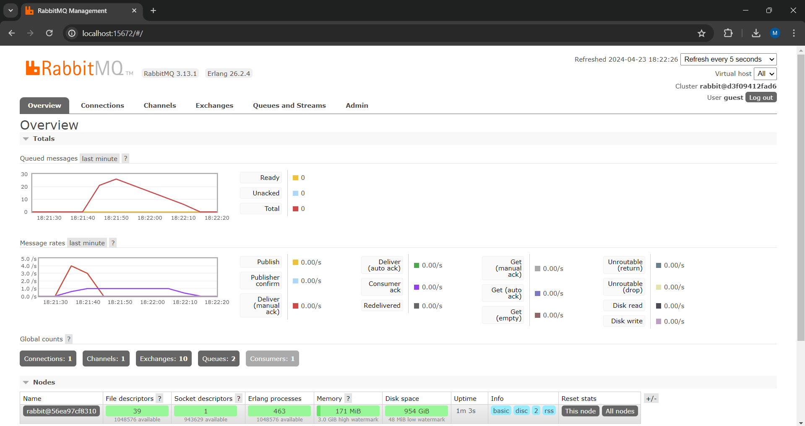
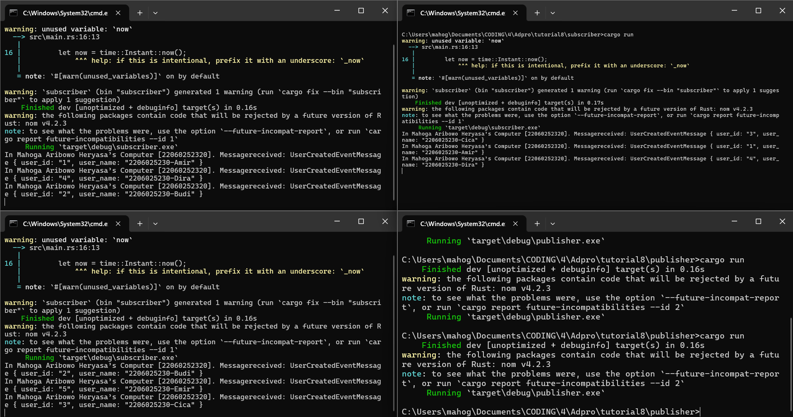
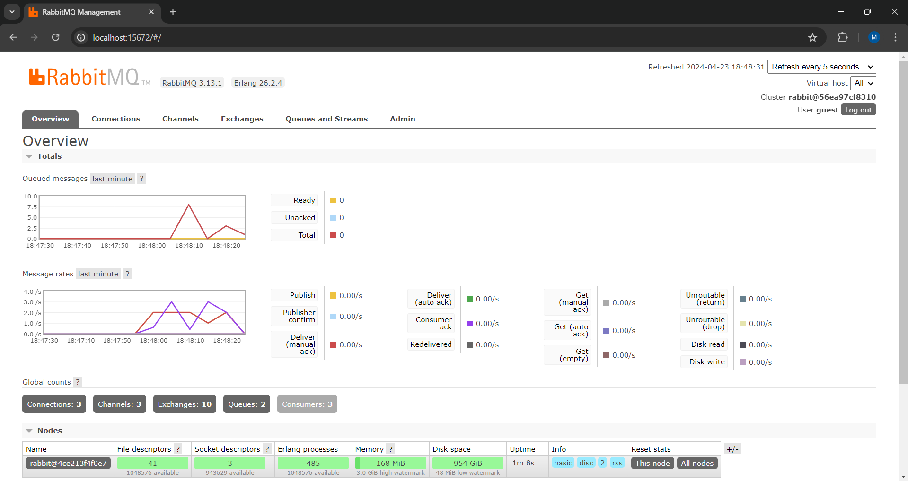

# advprog-modul8-Subscriber

# Mahoga Aribowo Heryasa

# 2206025230

### what is amqp?

AMQP atau *Advanced Message Queuing Protocol* adalah sebuah protokol komunikasi yang digunakan untuk pertukaran pesan antara aplikasi dan sistem yang saling bekerja sama. AMQP dirancang untuk mendukung komunikasi yang andal, efisien, dan aman antara berbagai aplikasi atau sistem yang mungkin menggunakan bahasa atau platform yang berbeda.

Dalam konteks `Subscriber`, AMPQ di implementasikan untuk mengubungkan antrean pesan dengan aplikasi, dengan menggunakan `CrosstownBus` yang memantau pengiriman dan penerimaam pesan dari antrean yang terhubung ke broker AMQP.

### what it means? guest:guest@localhost:5672 , what is the first quest, and what is the second guest, and what is localhost:5672 is for? 

`guest:guest@localhost:5672` adalah bentuk URL dengan format `<username>:<password>@<host>:<port>` yang mengubungkan aplikasi ke server AMQP dengan.

- `guest` pertama adalah *username* pengguna yang digunakan untuk autentikasi di RabbitMQ.
- `guest` kedua adalah *password* pengguna yang digunakan untuk autentikasi di RabbitMQ.
- `localhost:5672` adalah *hostname* dan port dari broker AMQP. *hostname* "localhost" berarti broker AMQP diharapkan berjalan pada mesin yang sama di mana aplikasi berjalan. Sementara, port 5672 adalah port default untuk komunikasi AMQP.

### Simulation slow subscriber

Ketika saya mensimulasikan *slow subscriber* dan memasangkan *delay* satu detik ke *subscriber* untuk penerimaan data dari *message broker*, terdapat sekitar 25 *queued message* yang terdata. Hal ini terjadi karena ketika *publisher* saya buat mengirimkan beberapa data dalam waktu singkat, *subscriber* tidak dapat menerima data tersebut secara langsung, sehingga terbentuklah *message queue* yang menunggu penemerimaan data dari *subscriber* satu persatu. Semakin banyak data yang dikirim *publisher* semakin besar *message queue* karena akan semakin banyak pesan penerimaannya tertunda.

### Running at least three subscribers

Berdasarkan grafik *queued message*, pesan yang masuk antrian turun drastis, hal ini terjadi karena data yang dikirim oleh *publisher* akan tersebar secara merata ke tiga *subcriber* yang berjalan bersamaan. Penerimaan data yang tersebar mengurangi banyak antrian pesan karena pesan yang diterima dalam satu waktu lebih banyak dari yang sebelumnya hanya menggunakan satu *subscriber*.